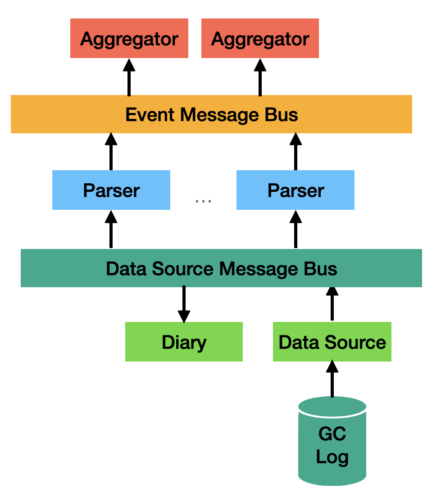
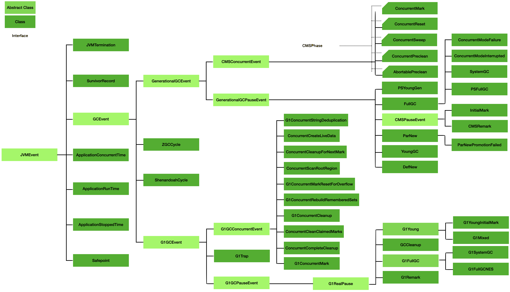

# Microsoft GCToolKit Developers Guide

---

## Introduction

GCToolkit is comprised of 3 Java modules, vertx, parser, and api. This document describes how each of these modules fits together to support the conversion of a garbage collection log to a stream of garbage collection events.
Additionally, GCToolkit contains several components that perform the heavy lifting. These components include, a framework to interact with data sources, diary, data source bus, parsers, and event source bus and finally, a framework to support the aggregation of events.
The purpose of this document is to provide a brief description of each of these components to aid in the further development of this toolkit.


Fig 1. GCToolKit Component Map

<todo: Link to javadoc?>

### Vert.x Message Bus and Verticles

A new messaging API has been added to the gctoolkit-api module. This api breaks the direct dependency of GCToolKit on Vert.x. The gctoolkit-vertx module has been refactored to provide an implementation of this new api. The new api supports the two different message channels, one for gc log entries and the other for JVMEvent objects. 
[JVMEvent objects](#JVMEvent) are covered later on in this document.

The gctoolkit-vertx module retains the implementation support for messaging for gc log entries and JVMEvent objects. It also retains the use of verticles as part of the implementation. The verticles are used to encapulate listener behaviour.

 
### Data Source 

DataSource is an interface that allows one to define specializations for a source of GC events that maybe of interest. Currently the toolkit contains two data sources, a FileDataSource and a SafepointLogFile. A GClogFile is a specialization of a FileDataSource. This is in turn has two specializations, SingleGCLogFile and RotatingGCLogFile. Each of these concrete implementations are comprised of either a GCLogFileSegment or a GCLogZipFile Segment. The accepted formats currently are, a directory (for all files in that directory or a randomly chosen file for the SingleGCLogFile), zip (for all files in the zip that match the base name found in the zip, or the first zipsegment for SingleGCLogFIle), GZip (for a single file), an individual file, or rotating log (as defined by the base name). Each of the concrete classes take care of the details of being able to create a continuous stream of their contents.

Another role of the DataSource is to provide a Diary (or summary) of important features found in the data. This includes information such as, is the log unified or a pre-unified, which version of the JVM produced the log, which flags where used to produce the file, which collector (combinations) are in play and so on. This information is used to construct the data paths through GCToolkit. It may also be used by clients of GCToolkit for their own purposes. For example, analytics may use the information to modulate how they process data.

An example of this would be an analytic that looked at System.gc() behaviour. One of the things that this analytic would attempt to determine is if there was a constant interval between System.gc() calls. If the interval was 60 minutes, then it it likely the call was due to RMI. In JDK 1.7.0_40 the logs stopped reporting user triggered collections unless a new flag (PrintGCCause) was enabled. This left the analytic blind to these events. In JDK 1.8.0, this new flag was automatically turned on when the PrintGCDetails flag was set. Making the analytics aware of the JDK version allowed them to calculate when System.gc() was likely being called thus enabling the analysis when the cause was missing in the log.

### Parsers

The parsers extract information from the log files and use it to generate JVMEvents. All JVMEvents share the same 3 characteristics; the type of the event (as can be seen in the implementation), the time of the event, and the duration of the event. These properties are immutable and as such, the creation of a JVMEvent is delayed until they are known.

The parse rules make heavy use of regular expressions. This is done so that the parser can make a best effort to extract information from a log even if that log is mixed with output from an unexpected source of the log or, the logs lines are some how corrupted.

The currently existing parsers are generational, G1, Z, and Shenandoah. The generational parser cover the serial, parallel (PSYoung, PSOld), ParNew, CMS, and iCMS collectors. There are separate parsers for unified and pre-unified logs produced by the generational and G1 collectors. The pre-unified generational collectors should cope with logs produced by JDK 1.4.2 whereas the G1 log parsers are for JDK 8+. ZGC support starts at JDK 16 whereas Shenandoah starts at JDK 11.

The flow through the parser starts with it accepting a log line. The line is run through a set of filters designed to recognize if we are interested in parsing it or not. If we are interested, the line is run over a set of regular expressions encapsulated in a class called GCParseRule. If the line hits a GCParseRule, a corresponding parse method is called. The values extracted from the log lines will be stored in a forward reference. This forward reference will be called upon to create the event once all of the lines for that GC event have been scanned. The event is then published on the JVMEvent message bus.

An example of a GCParseRule can be seen in the code fragment below.


GCParseRule CONCURRENT_CYCLE_END = new GCParseRule("CONCURRENT_CYCLE_END", "Concurrent Cycle " + CONCURRENT_TIME);

This rule is designed to capture the unified log message (as can be seen below) that signals the normal completion of a concurrent cycle. All GCParseRules are designed to capture either a single line or a group of strongly related lines.

[73.171s][info ][gc            ] GC(263) Concurrent Cycle 89.437ms

If we look at the rule we can see that it has a name followed by a regular expression pattern. The pattern in this case has bee built up with the customer clause “Concurrent Cycle “ which is then followed by the String CONCURRENT_TIME. CONCURRENT_TIME is defined to be the same format as PAUSE_TIME. PAUSE_TIME is defined as TIME followed by 0 or 1 space which is then followed by either sec, secs or ms. TIME is an optional negative sign (“-“ followed by a REAL_NUMBER. The number is contained within a regex capture group. A REAL_NUMBER is an INTEGER followed by a decimal separator (. or ,) and another INTEGER value. Finally, INTEGER is defined as a sequence of numbers of length 1 or more.

String CONCURRENT_TIME = PAUSE_TIME;
String PAUSE_TIME = TIME + "\\s?(?:secs?|ms)";
String TIME = "(-?" + REAL_NUMBER + “)";
String REAL_NUMBER = INTEGER + DECIMAL_POINT + INTEGER;
String DECIMAL_POINT = "(?:\\.|,)";
String INTEGER = "\\d+";

Since many lines contain either a pause or concurrent time, defining these “tokens” eases the complexity of creating and debugging the parse rules.

#### Testing

There are two main types of tests that are used to QA parsers and rules. The first is known as a rules capture test. In this test the rule is exposed to everything that it is likely to encounter. The test passes if the rule captures everything it should capture and doesn’t capture anything else. In the former test, the parser is configured to send generated events to the test. The test the counts each of the different types of events. The test passes if the counts for each event type reach the expected value.

There is a third type of test that has, unfortunately, not been applied to all parsers as of yet. In this test, the parsers will parse a log fragment to produce a well known event. The test passes if all of the attributes of that event match the expected value.


For historical reasons, SurvivorSpace is treated as a JVMEvent even though in reality, it’s an attribute of a young generational collection. This record is created by a parser that is specialized to parse the log and extract out the survivor information.

### JVMEvent

A JVMEvent represents something that happened in the JVM. The primary attributes are the type of event, the time of the event, and it’s duration. Each specialization of JVMEvent will contain attributes that are specific to that event. For example, a PSYoung event represents a Parallel Young generational collection. In addition to the information above, it will have heap occupancy before and after the collection along with the size of heap before and after the collection. Each event will contain more or less information depending upon the level of detailed information in the log file.

As previously mentioned, any survivor space data will be ignored as that is dealt with in its own event.  A complete set of events can be seen in the diagram below. A complete discription of each event can be found in the corresponding JavaDoc.


Figure 2. GCToolkit Event Hierarchy

### Aggregator and Aggregation


As can be seen in Figure 1, the end point for delivery of a JVMEvent is an Aggregator. Aggregator classes must be provided by the users of GCToolkit as they are not provided as they are considered out of scope for this project. The role of the Aggregator is to capture the JVMEvent objects that are of interest to it and the extract the data of interest and pass it along to an Aggregation.

As is the case with Aggregator, Aggregation classes need to be registered with GCToolkit. Aggregations can be registered via the GCToolkit API or through the module SPI. The benefit of using the SPI is that it allows the user to add additional Aggregations without having to modify code.

The role of an Aggregation is to collect the data and perform all calculations needed to transform the event data into a form that fits the needs of the client. For example, a GUI may want to display heap occupancy after collection. The Aggregator would capture all GC pause events from which contain reasonable accurate measures of this metric. This information would be collected into an Aggregation. 

    It is the responsibility of GCToolkit to load and register all instances of Aggregation via the module’s SPI

```
public class Main {

    public static void main(String[] args) throws IOException {
        new Main().analyze(args[0]);
    }

    public void analyze(String gcLogFile) throws IOException {
        /**
         * GC log files can come in  one of two types: single or series of rolling logs.
         * In this sample, we load a single log file.
         * The log files can be either in text, zip, or gzip format.
         */
        GCLogFile logFile = new SingleGCLogFile(Path.of(gcLogFile));
        GCToolKit gcToolKit = new GCToolKit();

        /**
         * This call will load all implementations of Aggregator that have been declared in module-info.java.
         * This mechanism makes use of Module SPI.
         */
        gcToolKit.loadAggregationsFromServiceLoader();

        /**
         * The JavaVirtualMachine contains the aggregations as filled out by the Aggregators.
         * It also contains configuration information about how the JVM was configured for the runtime.
         */
        JavaVirtualMachine machine = gcToolKit.analyze(logFile);

        // Retrieves the Aggregation for HeapOccupancyAfterCollectionSummary. This is a time-series aggregation.
        String message = "The XYDataSet for %s contains %s items.\n";
        machine.getAggregation(HeapOccupancyAfterCollectionSummary.class)
                .map(HeapOccupancyAfterCollectionSummary::get)
                .ifPresent(summary -> {
                    summary.forEach((gcType, dataSet) -> {
                        System.out.printf(message, gcType, dataSet.size());
                    });
                });

        Optional<CollectionCycleCountsSummary> summary = machine.getAggregation(CollectionCycleCountsSummary.class);
        summary.ifPresent(s -> s.printOn(System.out));
        // Retrieves the Aggregation for PauseTimeSummary. This is a com.microsoft.gctoolkit.sample.aggregation.RuntimeAggregation.
        machine.getAggregation(PauseTimeSummary.class).ifPresent(pauseTimeSummary -> {
            System.out.printf("Total pause time  : %.4f\n", pauseTimeSummary.getTotalPauseTime());
            System.out.printf("Total run time    : %.4f\n", pauseTimeSummary.getRuntimeDuration());
            System.out.printf("Percent pause time: %.2f\n", pauseTimeSummary.getPercentPaused());
        });

    }
}

```

```
@Collates(HeapOccupancyAfterCollection.class)
public class HeapOccupancyAfterCollectionSummary extends HeapOccupancyAfterCollectionAggregation {

    private final Map<GarbageCollectionTypes, XYDataSet> aggregations = new ConcurrentHashMap<>();

    public void addDataPoint(GarbageCollectionTypes gcType, DateTimeStamp timeStamp, long heapOccupancy) {
        XYDataSet dataSet = aggregations.get(gcType);
        if ( dataSet == null) {
            dataSet = new XYDataSet();
            aggregations.put(gcType,dataSet);
        }
        dataSet.add(timeStamp.getTimeStamp(),heapOccupancy);
    }

    public Map<GarbageCollectionTypes, XYDataSet> get() {
        return aggregations;
    }

    @Override
    public boolean hasWarning() {
        return false;
    }

    @Override
    public boolean isEmpty() {
        return aggregations.isEmpty();
    }

    @Override
    public String toString() {
        return "Collected " + aggregations.size() + " different collection types";
    }
}
```

```
@Aggregates({EventSource.G1GC,EventSource.GENERATIONAL,EventSource.ZGC,EventSource.SHENANDOAH})
public class HeapOccupancyAfterCollection extends Aggregator<HeapOccupancyAfterCollectionAggregation> {

    public HeapOccupancyAfterCollection(HeapOccupancyAfterCollectionAggregation results) {
        super(results);
        register(GenerationalGCPauseEvent.class, this::extractHeapOccupancy);
        register(G1GCPauseEvent.class, this::extractHeapOccupancy);
        register(ZGCCycle.class,this::extractHeapOccupancy);
        register(ShenandoahCycle.class,this::extractHeapOccupancy);
    }

    private void extractHeapOccupancy(GenerationalGCPauseEvent event) {
        aggregation().addDataPoint(event.getGarbageCollectionType(), event.getDateTimeStamp(), event.getHeap().getOccupancyAfterCollection());
    }

    private void extractHeapOccupancy(G1GCPauseEvent event) {
        aggregation().addDataPoint(event.getGarbageCollectionType(), event.getDateTimeStamp(), event.getHeap().getOccupancyAfterCollection());

    }

    private void extractHeapOccupancy(ZGCCycle event) {
        aggregation().addDataPoint(event.getGarbageCollectionType(), event.getDateTimeStamp(), event.getLive().getReclaimEnd());
    }

    private void extractHeapOccupancy(ShenandoahCycle event) {
        aggregation().addDataPoint(event.getGarbageCollectionType(), event.getDateTimeStamp(), event.getOccupancy());
    }
}
```

## License

Microsoft GCToolKit is licensed under the [MIT](https://github.com/microsoft/gctoolkit/blob/master/LICENSE) license.
